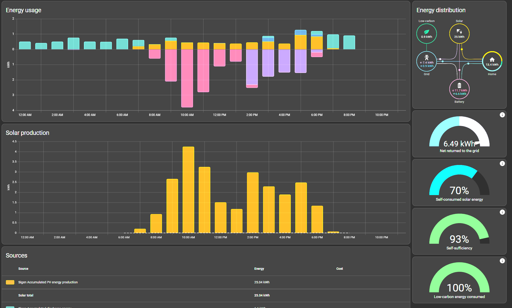
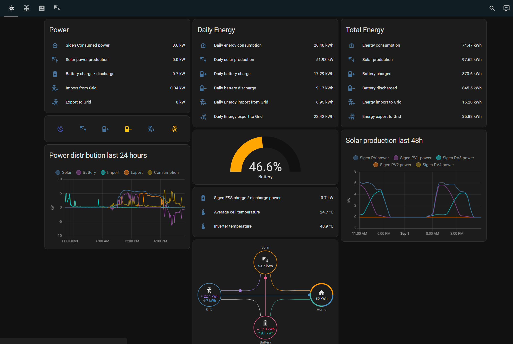
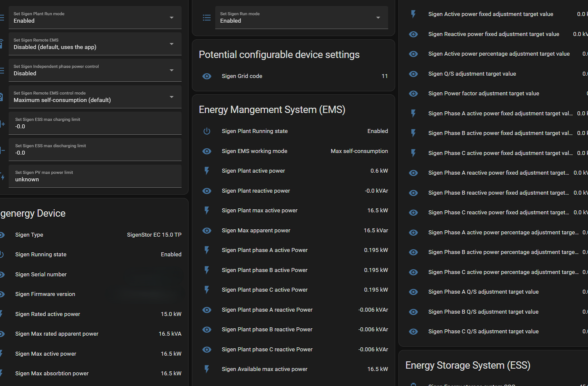
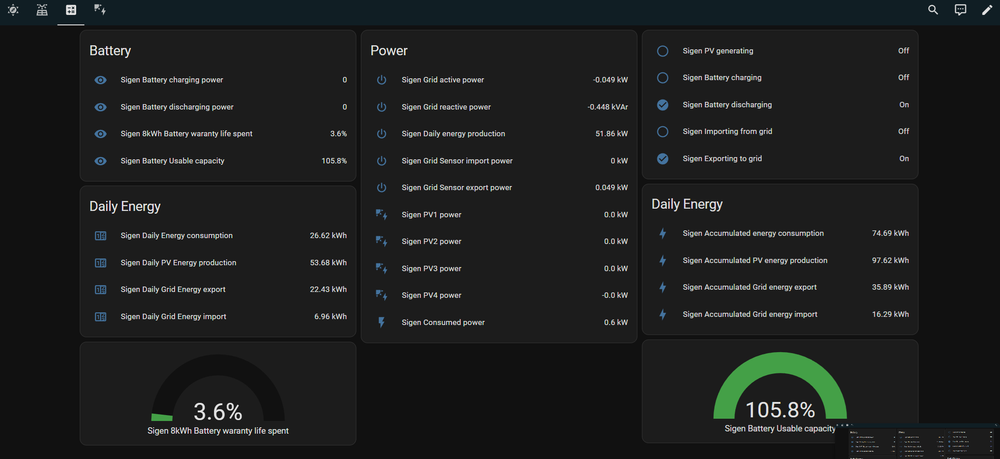

An *easy-to-use YAML-based integration* for Sigenergy inverters, battery and DC charger for Home Assistant. 

# Contents
- [1. Overview](#1-overview)
- [2. Documentation](#2-documentation)
- [3. Support](#3-support)
- [4. Visual impressions](#4-visual-impressions)
- [5. Tested configurations](#5-tested-configurations)
- [6. Status and future work](#6-status-and-future-work)
- [7. Contribution](#7-contribution)


# 1. Overview

This integration lets you gather sensor data and control the EMS (Energy Management System) of Sigenergy inverter, battery and DC charger.

## 2. Documentation

The documentation covers following topics:

[Prerequisites](https://github.com/TypQxQ/Sigenergy-Home-Assistant-Integration/wiki/1.-Prerequisites)

[Installation/ Configuration](https://github.com/TypQxQ/Sigenergy-Home-Assistant-Integration/wiki/2.-How%E2%80%90to%E2%80%90install)

[Dashboard Setup](https://github.com/TypQxQ/Sigenergy-Home-Assistant-Integration/wiki/3.-How-to-configure-the-dashboards)

[Usage Instructions](https://github.com/TypQxQ/Sigenergy-Home-Assistant-Integration/wiki/4.-How-to-use)

[Wiki: FAQ, Troubleshooting, Known Issues](https://github.com/TypQxQ/Sigenergy-Home-Assistant-Integration/wiki/)

## 3. Support

If you any kind of assistance, you have three options:

a) Use the [github discussion](https://github.com/TypQxQ/Sigenergy-Home-Assistant-Integration/discussions) 

b) Only if code-related (bugs / contributions): Open an  [github issue](https://github.com/TypQxQ/Sigenergy-Home-Assistant-Integration/issues) or isse a pullrequest

## 4. Visual impressions

Home Asisstants built-in Energy Dashboard



Default dashboard tab "Overview"



Default dashboard tab "ModBus values"




Default dashboard tab "Calculated values"




Default dashboard tab "EMS"


## 5. Tested configurations
I have a **Sigenergy SigenStor EC 15.0 TP** Inverter and **2 8kWh batteries** updating frequently to the latest **Home Assistant** (> 2023.3). I try to thoroughly test features before releasing them, but I cannot test everything (e.g., backup capabilities, DO-related, ...)

The Modbus register mapping is based on two documents I found online. I am not sure if I am allowed to share the files, but you can search for them using their names. 
Let me know in the github discussions, if there are newer versions available.

```
Sigenergy Modbus Protocol
Version: V1.7
Release date: 2024-04-09
483828-sigenergy-modbus-protocol-20240409-pdf
```

## 6. Status and future work 
1. Energy consumption differs from the app but maybe in a good way? Closer to grid provider.
2. Nicer dashboard integrated with Nordpol.


## 7. Contribution
We are happy to share our experiences - feel encouraged to share yours with us, too! 

If you have any questions, feature requests, found any bugs or have some hints how to update the documentation, just ask on Github Discutions.

**Thanks to all the people, who are actively contributing to this project! Special thanks to @mkaiser for the Sungrow integration on wich this is based**
