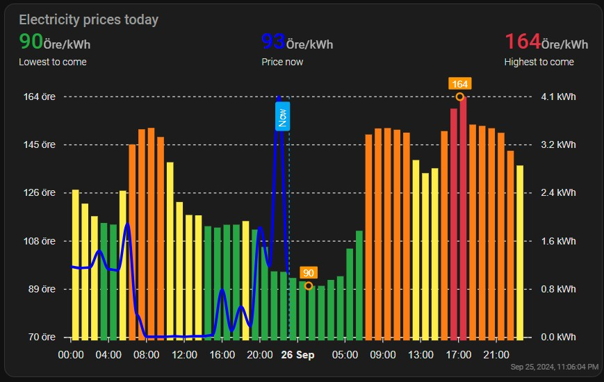

# Energy price chart using nordpool prices.

This is my atempt at a chart displaying todays prices and tomorows prices when available along with imported energy.
- Upper and Lower price threshold is calculated for today+tomorows ***comming*** price.
  - Orange is upper 3:rd of the pricing interval.
  - Green is lower 3:rd of the prices interval.
  - Red is the upper 10% of the pricing interval.



# Pre-requirements

This has not been tested on HA earlier than 2024.9 and requires the following HACS addons:

- Nordpool - For getting energy prices.
- Config Template Card Card - For scripting inside the chart card.
- lovelace-card-mod - For styling.

The Nordpool entity should be changed from the default name to just "nordpool" as per the components installation instructions.

# Installation
- Add the *nordpool_energy_chart.yaml* file to Home Assistant's packages folder for inclusion in Home Assistant. See here for example: [Installation of Sigenergy integration](https://github.com/TypQxQ/Sigenergy-Home-Assistant-Integration/wiki/2.-How%E2%80%90to%E2%80%90install)
- Copy - paste the raw card code below to your lovelace dashboard. Add any card and replace the raw code that you can edit by clicking on the *SHOW CODE EDITOR* in the bottom left.
```
type: custom:config-template-card
variables:
  hours: '`${states[''input_number.total_nordpool_hours_available''].state}h`'
entities:
  - input_number.total_nordpool_hours_available
card:
  type: custom:apexcharts-card
  graph_span: ${hours}
  yaxis:
    - id: y1
      min: 70
      max: auto
      apex_config:
        opposite: false
        forceNiceScale: true
        decimalsInFloat: 0
        labels:
          formatter: |
            EVAL:function(value) {
              return value.toFixed(0) +" öre";
            }
    - id: y2
      min: 0
      max: auto
      apex_config:
        opposite: true
        forceNiceScale: true
        decimalsInFloat: 2
        labels:
          formatter: |
            EVAL:function(value) {
              return value.toFixed(1) +" kWh";
            }
  apex_config:
    chart:
      height: 340px
    legend:
      show: false
    title:
      floating: false
      align: center
      style:
        fontSize: 20px
        fontWeight: bold
    xaxis:
      labels:
        datetimeFormatter:
          hour: HH:mm
  show:
    last_updated: true
  experimental:
    color_threshold: true
  header:
    title: Electricity prices today
    show: true
    show_states: true
    colorize_states: true
  span:
    start: day
  now:
    show: true
    label: Now
  series:
    - entity: sensor.nordpool
      yaxis_id: y1
      name: Total purchease price
      offset: '-30min'
      float_precision: 0
      show:
        extremas: true
        in_header: false
        header_color_threshold: true
      type: column
      data_generator: >
        return (entity.attributes.raw_today.map((start, index) => {
          return [new Date(start["start"]).getTime(), entity.attributes.raw_today[index]["value"]];
        })).concat(entity.attributes.raw_tomorrow.map((start, index) => {

        return [new Date(start["start"]).getTime(),
        entity.attributes.raw_tomorrow[index]["value"]];

        }));
      color_threshold:
        - value: -1000
          color: '#007bff'
          opacity: 1
        - value: 70
          color: '#28a745'
          opacity: 1
        - value: >-
            `${
            parseFloat(states['input_number.low_threshold_nordpool_price'].state)
            }`
          color: '#ffed4a'
          opacity: 1
        - value: >-
            `${
            parseFloat(states['input_number.high_threshold_nordpool_price'].state)
            }`
          color: '#fd7e14'
        - value: >-
            `${
            parseFloat(states['input_number.high_threshold_nordpool_price_top'].state)
            }`
          color: '#dc3545'
    - entity: sensor.sigen_accumulated_grid_energy_import
      yaxis_id: y2
      name: Grid Import
      color: blue
      float_precision: 3
      show:
        extremas: false
        in_header: false
        header_color_threshold: true
      type: line
      stroke_width: 3
      extend_to: false
      group_by:
        func: delta
        duration: 1h
    - entity: sensor.nordpool
      type: column
      color: '#28a745'
      float_precision: 0
      stroke_width: 2
      name: Lowest to come
      show:
        in_chart: false
        legend_value: false
      group_by:
        func: min
        duration: 1d
      data_generator: >
        const now = new Date().getTime(); const futureData =
        entity.attributes.raw_today.concat(entity.attributes.raw_tomorrow).filter(data
        => new Date(data.start).getTime() >= now); return futureData.map((data,
        index) => {
          return [new Date(data.start).getTime(), futureData[index].value];
        });
    - entity: sensor.nordpool
      name: Price now
      color: blue
      type: column
      show:
        in_chart: false
      float_precision: 0
    - entity: sensor.nordpool
      type: column
      color: '#dc3545'
      float_precision: 0
      stroke_width: 2
      name: Highest to come
      show:
        in_chart: false
        legend_value: false
      group_by:
        func: max
        duration: 1d
      data_generator: >
        const now = new Date().getTime(); const futureData =
        entity.attributes.raw_today.concat(entity.attributes.raw_tomorrow).filter(data
        => new Date(data.start).getTime() >= now); return futureData.map((data,
        index) => {
          return [new Date(data.start).getTime(), futureData[index].value];
        });
layout_options:
  grid_columns: full
```

# Configuration 

Configure your Nordpool integration.

In the chart-card you should change the following to suit your needs:

  - `min: 70` on line 11 to what you want the minimum in the chart to be. I have to pay at least 0.7 SEK in grid transfer fee.
  - `value: 70` on line 87 is the threshold for low price. Under this is Very low price or negative price.
  - `öre` on line 20 to whatever currency you want.
  - `decimalsInFloat: 0` to indicate how many decimals to show.
  - `float_precision: 0` to indicate how many decimals to show.

If your Nordpool integration is called anything else than `sensor.nordpool`, change either the sensor name or inside the card and the .yaml fiel.

If you use anything elsse than a Sigenergy system then change all values strating with sigen to suit your needs.

--

Happy savings!